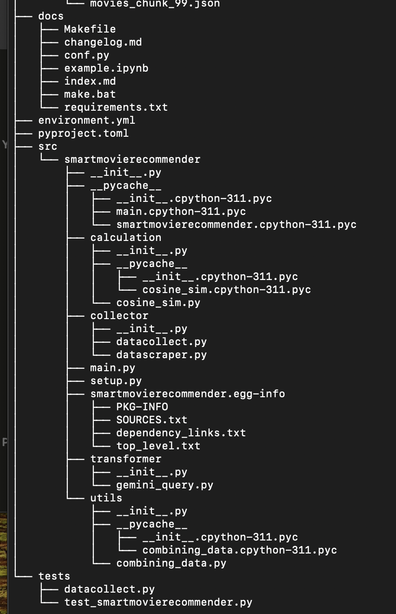

# Smart Movie Recommender

# Authors: Caroline Delva, Lizzie Healy, Rachna Rawalpally 

**Please note this project was orginally completed as part of DSAN5400 at Georgetown University. The repo has been copied to my personal GitHub for viewing purposes.**

## Overview

 The `Smart Movie Recommender` is a Python package that contains a data pipeline. This pipeline includes a webscraper of imdb.com and an api request form OmbdAPI, a query to a gemini to compute a score of movies based on genres and cosine similarity calculation between the user provided input. This hosted on a gradio application that a user can interact with once deployed.

 The `Smart Movie Recommender` will allow users to input movie titles and receive five movie recommendations based on cosine similarity scores.

## Project Structure

- **collector**: This folder contains two scripts `datacollect.py` and `datascraper.py`
    - The `datacollect.py` file performs an api query to omdbapi
    - The `datascraper.py` file scrapes imdb website using a custom web scraper 
- **transformer**: This folder contains two scripts `gemini_query.py` 
    - The `gemini_query.py` file chats with Gemini to score the movies 
  
- **calculation**: This folder contains two scripts `cosine_sim.py` 
    - The `cosine_sim.py` file performs consine similarity between the inputted movie's vector and the movies in the dataset 
- **utils**: This folder contains `combining_data.py` 
    - The `combining_data.py` combines the movies in the dataset and implements fuzzy matching for information retrieval purpose. 
- **tests**: This folder contain `test_smartmovierecommender.py` 
   - The `test_smartmovierecommender.py` test the functionality of the `smartmovierecommender` package. 

- **main.py**: Runs the `smartmovierecommender` package by computing the cosine similarity between an movie input and the available movies in the dataset. 

- **app.py**: hosts a gradio app to allow user to interact with `smartmovierecommender` package.


### Install Dependencies 

```bash
cd smartmovierecommender
pip install -r requirements.txt
pip install -e smartmovierecommender 
```
## Example Usage

In order to utilize the SmartMovieRecommender, the user follow these steps:

- Download the files and package from GitHub
- Activate the environment 'dsan5400'
- Navigate to src/smartmovierecommender and ensure setup.py is within this file
- pip install the smartmovierecommender package (either pip install -e smartmovierecommender or pip install . if in the correct location)
- Navigate to the root of the project where app.py is located
- Run the app file utilizing python app.py
- Follow the local link provided in the terminal to an external browser
- Enter movie titles into the box and receive recommendations.


